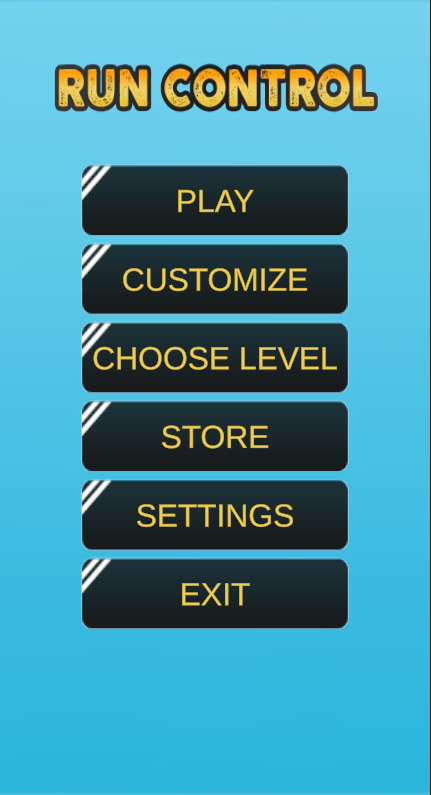
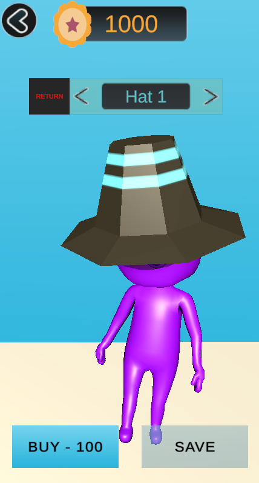
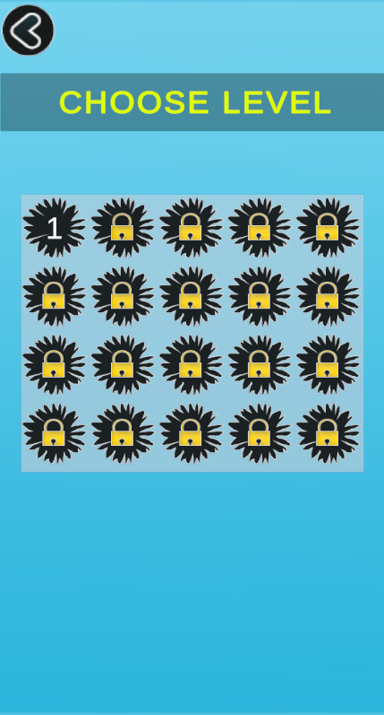
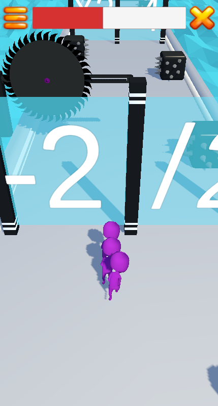
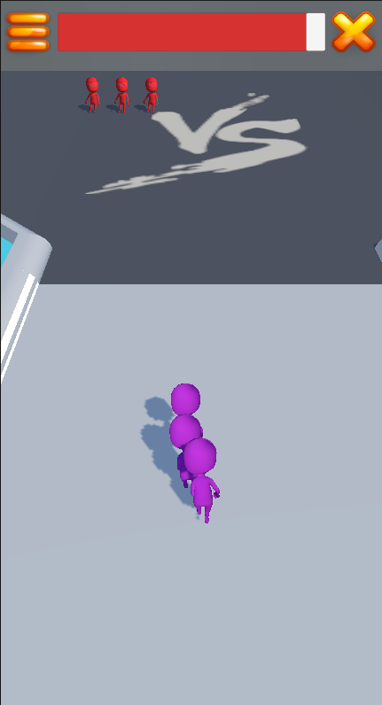
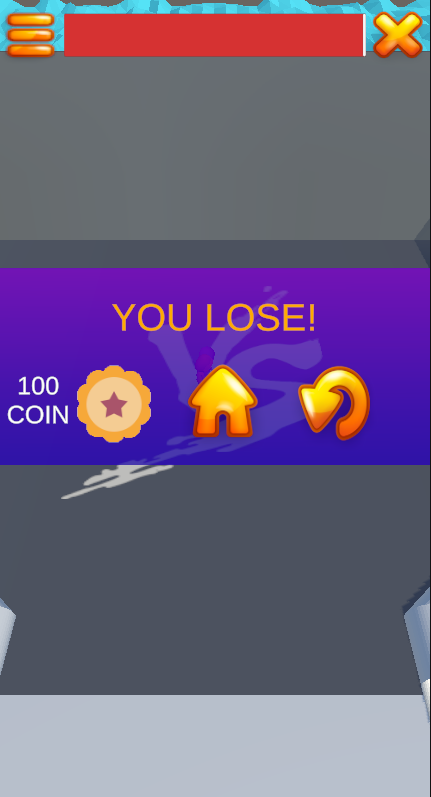
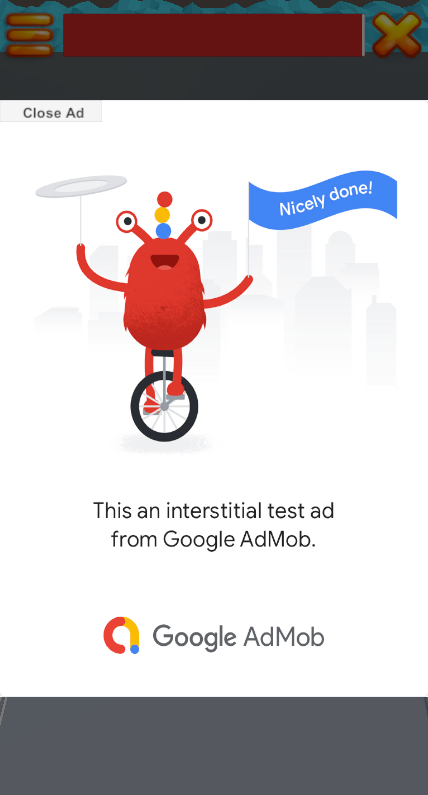
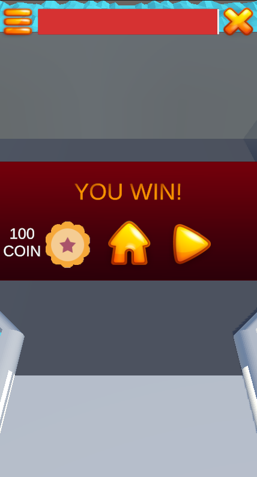

<h2>
  About :grey_question:
</h2>

  Run Control 3D is an Hypercasual Run Game.

<h2>Features 📱</h2>
<ul>
  <li>Unity 3D engine</li>
  <li>C# Codebase</li>
  <li>Ai Navmesh</li>
  <li>Object Pooling</li>
  <li>PlayerPrefs and FileSystem data storage</li>
  <li>Multilanguage</li>
  <li>Interstitial and Rewarded ads (AdMob)</li>
  <li>In-App Purchases</li>
  <li>Multilanguage</li>
</ul>
<h2>
  Screenshots :camera_flash:
</h2>
<h3>Main Menu</h3>

    
    
    
    

<h3>In Game Screens</h3>

    
    
    
    
    

<h1> Installation </h1>

### How to run the example?

1. Clone this repo 
2. Open Unity 3D File > Open Project > Select Run Control 3D from Unity Hub

